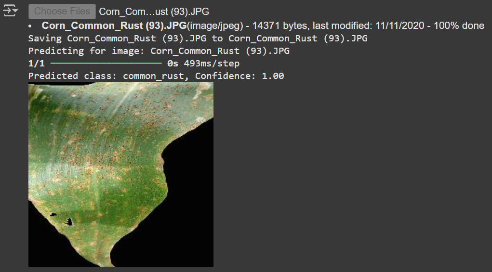

# Corn Leaf Disease Classification using VGG16

This project is my first Machine Learning portfolio, where I developed a model to classify diseases on corn leaves using transfer learning with the VGG16 architecture. The project aims to accurately predict corn leaf diseases such as blight, common rust, and gray leaf spot, along with identifying healthy leaves. The dataset for this project was sourced from [Kaggle](https://www.kaggle.com/datasets/smaranjitghose/corn-or-maize-leaf-disease-dataset).

## Table of Contents
- [Dataset](#dataset)
- [Project Overview](#project-overview)
- [Installation](#installation)
- [Usage](#usage)
- [Challenges and Learnings](#challenges-and-learnings)
- [Future Improvements](#future-improvements)
- [Acknowledgments](#acknowledgments)

## Dataset
The dataset used for this project is the **Corn or Maize Leaf Disease Dataset** from Kaggle. You can find and download it [here](https://www.kaggle.com/datasets/smaranjitghose/corn-or-maize-leaf-disease-dataset). It contains images of corn leaves categorized into four classes:
- Blight
- Common Rust
- Gray Leaf Spot
- Healthy

## Project Overview
The goal of this project is to classify corn leaf images into one of the four categories mentioned above. This is achieved by training a convolutional neural network (CNN) model using transfer learning. The VGG16 model, pre-trained on ImageNet, is fine-tuned to perform classification on the corn leaf dataset. By leveraging transfer learning, we can reduce the amount of data and training time required to achieve a high accuracy.

### Model Architecture
- **Base Model**: VGG16 (with pre-trained weights from ImageNet)
- **Layers Added**: Fully connected layers for classification with softmax activation for multi-class classification.
- **Input Shape**: (224, 224, 3) - each image is resized to 224x224 pixels before feeding into the model.

## Installation
To run this project, ensure you have the following dependencies installed. You can install them using `pip`:

```bash
pip install tensorflow keras numpy matplotlib
```

Additionally, if you plan to run this project in a Jupyter Notebook or Google Colab, make sure to set up and mount Google Drive (if using Google Colab) for convenient access to the dataset.

## Usage
1. **Clone this repository** to your local machine:
   ```bash
   git clone https://github.com/thec41n/corn-disease-classification.git
   ```

2. **Download the Dataset**:
   - Download the dataset from Kaggle and place it in a folder named `dataset` within the cloned repository directory, structured as follows:
     ```
     dataset/
     ├── train/
     │   ├── blight/
     │   ├── common_rust/
     │   ├── gray_leaf_spot/
     │   └── healthy/
     ├── validation/
     └── test/
     ```

3. **Run the Model**:
   - You can run the model training and prediction code in a Jupyter Notebook or Python script. Make sure to follow the specified structure for train, validation, and test folders.

4. **Test a Single Image**:
   - To test the model with a single image:
     ```python
     import tensorflow as tf
     from tensorflow.keras.preprocessing.image import load_img, img_to_array
     import numpy as np

     # Load the trained model
     model = tf.keras.models.load_model('best_corn_disease_model.h5')

     # Predict function
     def predict_image(image_path):
         img = load_img(image_path, target_size=(224, 224))
         img_array = img_to_array(img) / 255.0
         img_array = np.expand_dims(img_array, axis=0)
         prediction = model.predict(img_array)
         predicted_class = np.argmax(prediction, axis=1)[0]
         classes = ['blight', 'common_rust', 'gray_leaf_spot', 'healthy']
         return classes[predicted_class]

     # Example usage
     print(predict_image('path_to_your_image.jpg'))
     ```


Berikut adalah cara untuk memperbarui README.md dengan hasil testing menggunakan gambar dalam direktori test_result (dengan nama file 1.jpg, 2.jpg, 3.jpg, dan 4.jpg) ditampilkan dalam format 2 baris x 2 kolom.

Berikut adalah isi yang dapat Anda tambahkan di bagian bawah 4. Test a Single Image di README.md:

markdown
Copy code
### Example Test Results

Below are some example test results from the `test_result` directory. These images are resized to 500x500 and are displayed in a 2x2 grid format.

| Gray Spot | Blight |
|---------|---------|
|  |  |
| <b>Common Rust | <b>Healthy |
|  |  |

## Challenges and Learnings
Working on this project introduced me to key concepts in Machine Learning and deep learning. Here are some of the challenges and learnings I encountered:
- **Understanding Machine Learning**: I had to learn about basic machine learning concepts and tools needed for classification tasks.
- **Learning Transfer Learning and Fine-Tuning**: This project helped me understand transfer learning and the fine-tuning process, allowing me to leverage pre-trained models.
- **Dataset Requirements**: I realized that achieving high accuracy often requires a large and diverse dataset, and that data augmentation can improve the model's generalization.

## Future Improvements
- **Increase Dataset Size**: A larger dataset would likely improve model accuracy and robustness.
- **Experiment with Other Architectures**: Trying different CNN architectures such as ResNet or EfficientNet to compare performance.
- **Deploying the Model**: In the future, I hope to deploy this model as a web application for real-time leaf disease detection.

## Acknowledgments
- Thanks to [Smaranjit Ghose](https://www.kaggle.com/smaranjitghose) for providing the dataset on Kaggle.

